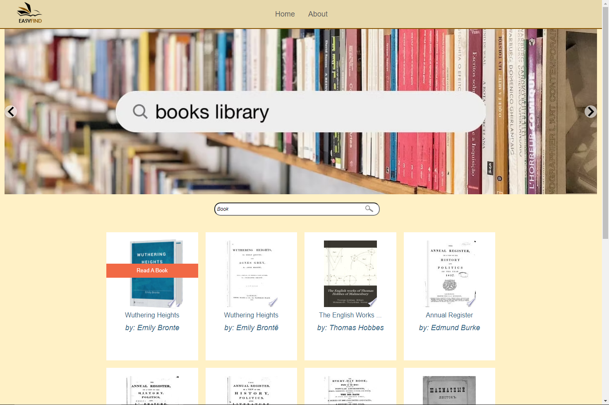

# EasyFind

## About the project

The aim is give you a  preview of a specific book. 
But the belief is that this should be simple and accessible to all.
EasyFind gets you all work related to a title that you search. 
We want to give users access to a digital library of hundreds if not thousands of books without any hassle. 

## User Story

* Book Lovers: Whether a one–book-a-year or one-book-a-week kind of reader
* Curious Souls: You want to see what is out there
* Researcher: Writers, Teachers, Students

## Scripts

### `npm start`

Runs the app in the development mode.

### `npm test`

Launches the test runner in the interactive watch mode.

### `npm run build`

Builds the app for production to the `build` folder.

## APIs Used

* [Integrate with the Google Books repository](https://developers.google.com/books/docs/v1/getting_started)
* [Embed book previews on your site](https://developers.google.com/books/docs/viewer/developers_guide)

## Node modules

* [Font Awesome](https://fontawesome.com/docs/web/setup/get-started)
* [axios](https://www.npmjs.com/package/axios)
* [bootstrap](https://www.npmjs.com/package/bootstrap)
* [react-router](https://reactrouter.com/en/main)
* [react-slideshow-image](https://www.npmjs.com/package/react-slideshow-image)
* [rxjs](https://www.npmjs.com/package/rxjs)

## Screenshot

## Questions
    
* The URL of the GitHub repository. [Repository link](https://github.com/vaselisk999/EasyFind).

* The URL of the deployed application. [Repository link](https://easyfindbook.netlify.app/).

## Team Members

Zodumo Mbuthuma,
Artur Karpenko,
Ahmed Sharif Mahamed